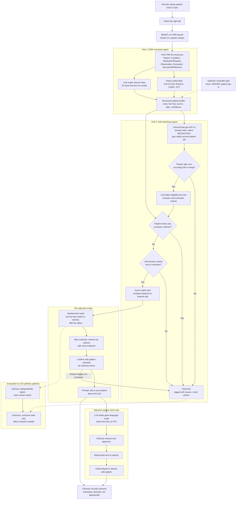

# right: system flow

How a patient chart becomes a ranked, explained list of recruiting anxiety trials in the right tab. Full requirements are in [PRD.md](PRD.md).

## Reading the chart

- **Solid arrows** are the live clinical path. **Dotted arrows** are optional inputs or the offline evaluation.
- **Exclusions are checked before inclusions.** One met exclusion drops the trial and stops evaluation.
- **Unknown is not a failure.** A criterion the chart cannot answer keeps the trial and becomes a "confirm with patient" item.
- **Dropped trials are never shown** to the clinician, but they are logged so the evaluation can sample them for wrongly excluded matches.
